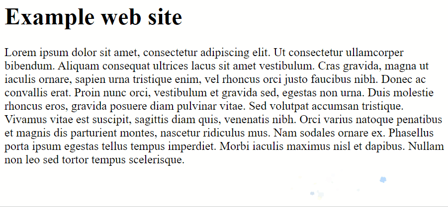

Minimal example of how to embed a particle system into a pure HTML application by using CDN hosted IIFE builds of `modular-particle-system` and `modular-particle-system-webgl-renderer`.

To test, simply open `index.html` in a web browser.
The dependencies are loaded from a CDN service and the only image asset is encoded into a string.
